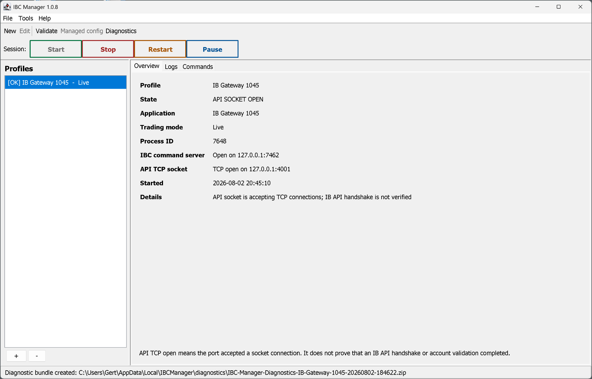

# IBC Manager



IBC Manager is a Windows-first graphical front end for configuring, launching,
monitoring, and controlling multiple IBC-managed Trader Workstation or IB
Gateway sessions.

It deliberately **does not reimplement or modify IBC**. The manager delegates
startup to the official `scripts\StartIBC.bat` from a separately installed IBC
release and uses IBC's command server for supported session controls. This keeps
IBC's mature Swing-dialog automation intact.

- Version: **1.0.21**
- IBC download channel: **latest published official GitHub release**
- IBC compatibility floor/reference: **3.24.2**
- Manager runtime target: **Java 17 or newer**; the selected IBC release's class-file requirement is checked separately before launch

## Version 1.0.21 dynamic latest-release installer

Version 1.0.21 no longer pins the GUI installer to one IBC version. Each
installation request queries the official `IbcAlpha/IBC` GitHub
`releases/latest` endpoint, selects the matching `IBCWin-<version>.zip` asset,
and validates the asset against the SHA-256 digest and size published in the
same GitHub release metadata.

The installer still fails closed. It accepts only a published non-draft,
non-prerelease numeric release at or above the tested 3.24.2 compatibility
floor. The downloaded tree must expose every launcher, JAR, helper, and command
capability required by IBC Manager. A future release that changes that interface
is rejected rather than installed blindly. Existing non-empty installations are
never silently upgraded or overwritten.

## Main capabilities

- Profile dashboard for IB Gateway and TWS, live or paper mode.
- Multiple isolated profiles with separate API ports, IBC command ports,
  settings directories, credentials, logs, and process identities.
- Common Windows installation discovery for IBC and offline TWS/Gateway builds.
- Optional resolution, download, and transactional installation of GitHub's
  latest published official Windows IBC release into the conventional `C:\IBC`
  directory.
- Structured editor for common IBC settings, including a dedicated
  `SecondFactorDevice` profile field.
- Raw `config.ini` editor that preserves comments, ordering, unknown future
  settings, blank values, and line endings while blocking persistent password
  assignments, including hidden duplicates and assignment-shaped comment/raw
  lines.
- Profile validation before save and before launch, including occupied-port
  preflight before any password-bearing runtime file is created.
- Start, graceful stop, explicitly confirmed force-isolated process cleanup,
  restart, pause, reconnect-market-data, reconnect-account, and enable-API
  operations. Start, Stop, Restart, and Pause use the same larger bold action
  style with separate accents. Manual Start, Stop, Restart, and Pause each
  require a contextual confirmation with Cancel selected by default. PAUSE is tracked
  through the expected Gateway/TWS exit and remains distinguishable from an
  unexpected crash.
- Process reattachment using exact PID and process start time.
- Prominent text-backed green/yellow/red status presentation in the dashboard
  and profile list. Green means only that the operating system reports a TCP
  listener on the configured API port; it does not claim an IB API handshake.
- Live IBC log viewing and state classification while manager-owned application
  and process logs are batched to disk every 60 seconds during normal operation.
- IBC command-server readiness derived from IBC lifecycle output, with one
  passive listener-table fallback when reattaching to an already-running
  process. API-port monitoring also inspects the operating-system listener table
  and never opens a raw client connection.
- Redacted diagnostic bundles.
- Interactive Windows Task Scheduler startup task.
- Windows DPAPI credential storage, manual-password mode, and external-config
  mode.
- No TOTP generation or submission.

## Version 1.0.19 IBC parser and lifecycle fidelity

Version 1.0.19 closes six remaining compatibility and diagnostics gaps found by
comparing IBC Manager with the exact official IBC 3.24.1 configuration, command,
and `StartIBC.bat` behavior:

- The semantic interpretation of an imported IBC configuration now comes from
  one full-file Java `Properties.load` pass. The separate scanner is used only
  to preserve comments, ordering, and line endings. If malformed syntax makes
  those two views disagree, persistent editing is blocked until the user fixes
  the text or explicitly canonicalizes IBC's authoritative property map.
- Normal and scheduled wrapper exits, including `ClosedownAt`, finish as
  **Stopped** rather than **Error**. Automatic restart, cold restart, login-timeout
  recovery, and second-factor-timeout recovery use a distinct yellow
  **Restarting** state while the wrapper launches the replacement IBC JVM.
- The log parser recognizes IBC 3.24.1's exact
  `Exiting after error with exit code=` wording while waiting for the wrapper's
  restart-or-exit decision, avoiding a premature red failure during recovery.
  An earlier IBC error remains authoritative even if `StartIBC.bat` later prints
  its generic `Normal exit` / `Gateway finished at` footer and returns zero.
- The command client accepts exact bare `OK` and `ERROR` lines as well as the
  normal `OK ...` and `ERROR ...` forms. Official IBC 3.24.1 normally includes
  the trailing status text, but the broader parser is safer for compatible
  wrappers and future releases.
- Profile validation and tooltips now enumerate the characters that cannot be
  transported safely through the official Windows batch launcher:
  `" % ! & | < > ^ ( )`. The error names the offending character and recommends
  simple locations such as `C:\IBC`, `C:\Jts`, and `C:\IBKRSettings`. A path
  under `C:\Program Files (x86)` is intentionally rejected because the batch
  wrapper re-expands values through `cmd.exe`.
- Imported raw settings containing a suspicious single Windows backslash receive
  a non-secret warning. For example, Java Properties interprets
  `IbDir=C:\Jts` as `C:Jts`; a literal path must be written as
  `IbDir=C:\\Jts`. Password or credential values are never echoed in the
  warning.

The canonical writer still emits ASCII/ISO-8859-1-safe Java Properties data and
verifies the generated bytes by loading them again with the JDK parser before
they are made available to IBC.

## Version 1.0.18 Windows detached-relay test cleanup reliability

The final 1.0.17 Windows package gate completed the relay behavior itself but
failed while deleting the temporary `logs` directory after the detached relay
had exited. The test fixture had deliberately placed both the relay and its
child process inside that disposable directory as their current working
directory. Windows can keep a terminating process's current-directory handle
non-deletable briefly after `ProcessHandle.isAlive()` becomes false.

Version 1.0.18 keeps the detached relay's test working directory outside the
disposable log tree. Test-tree cleanup also retries only transient
`FileSystemException` failures on Windows for a bounded five-second period.
Non-file-system failures still fail immediately, and an unreleased process or
handle still fails the test after the retry limit. The retry mechanism has its
own deterministic regression test. Production relay, logging, and process
supervision behavior is unchanged.

## Version 1.0.17 locale-stable IBC schedule validation

Version 1.0.16 validated `AutoLogoffTime` and `AutoRestartTime` with a
`DateTimeFormatter` that inherited the IBC Manager JVM's host locale. On a
Dutch Windows installation, the documented value `11:45 PM` was therefore
rejected before packaging, which also caused the managed-config synchronization
tests that use that value to fail.

Version 1.0.17 validates the documented, case-sensitive English `AM`/`PM`
grammar explicitly and independently of the Windows display locale. The fix
retains IBC's strict two-digit `hh:mm AM/PM` behavior and still rejects lowercase
`am`/`pm`. A fresh-JVM regression probe now runs under `nl-NL` on every test
execution so this locale dependency cannot silently return. The full 524-test
suite was also executed successfully under a Dutch JVM locale.

## Version 1.0.16 managed-config synchronization and compatibility re-audit

Version 1.0.16 makes the structured **Profile Edit** view and the raw **Managed
config** editor two views of one effective IBC configuration:

- Saving Managed config updates the profile's structured advanced-setting
  snapshot transactionally.
- Opening Profile Edit first synchronizes it from the current managed
  `config.ini`.
- Saving Profile Edit rewrites known managed settings while preserving comments,
  unknown/future settings, and unrelated raw values.
- Runtime launch treats the managed file as authoritative for advanced settings,
  so a stale profile snapshot cannot undo a raw edit.
- `SecondFactorDevice` participates in the same bidirectional synchronization.

A second source-level review of IBC Manager and every official IBC 3.24.1 path
that the Manager invokes or configures added stricter compatibility checks:

- Windows batch-argument safety is enforced by one shared policy in both profile
  validation and launch-script generation.
- Java Properties values are validated according to the exact whitespace,
  case-sensitivity, time, schedule, and slash-separated policy semantics used by
  IBC 3.24.1.
- FIX mode and FIX credentials are rejected because IBC Manager does not support
  the FIX CTCI Gateway workflow.
- `TrustedTwsApiClientIPs` is hidden from the structured editor because official
  IBC uses it only with FIX mode.
- Gateway profiles reject `ReadOnlyLogin=yes`; TWS-only or Gateway-ignored
  settings produce explicit warnings.
- The safe `ConfirmOrderIdReset=ignore/ignore` policy is normalized at runtime.

The Windows invalid-path regression test no longer assumes that every unsafe
batch string can first be represented by `java.nio.file.Path`. It verifies the
shared command-safety policy directly and accepts a host-filesystem
`InvalidPathException` only for characters Windows itself rejects before
application validation.

## Version 1.0.15 IBC 3.24.1 compatibility hardening

Version 1.0.15 is a compatibility-focused release based on a source-level audit
of IBC Manager and official IBC 3.24.1. It corrects the assumptions that matter
most for unattended operation:

- Runtime `config.ini` remains at the same ACL-restricted path for the complete
  lifetime of the official `StartIBC.bat` wrapper. IBC can therefore reload the
  same configuration after 2FA recovery, login timeout, auto-restart, or cold
  restart. The detached relay removes and scrubs the file after the wrapper
  exits, even when the Manager GUI has already closed.
- IBC configuration input and output now follow the exact Java Properties byte,
  separator, continuation, and escape semantics used by IBC's
  `Properties.load(InputStream)`. Generated files are ASCII/ISO-8859-1 safe and
  are verified through a real Java Properties round trip before writing.
- State-sensitive commands are disabled until IBC has reported `Login has
  completed`. This prevents commands such as `RECONNECTDATA` from reaching IBC
  before its main window exists.
- PAUSE is shown as **Pausing** after IBC accepts the command and becomes
  **Paused** only after the official wrapper reports `IBC is paused`. A later
  command error overrides an earlier `OK ... in progress` acknowledgement.
- Restart uses a controlled graceful Stop followed by a fresh Start. The Manager
  no longer sends IBC's native `RESTART`, whose fallback can change the
  application's persistent auto-restart schedule.
- Graceful Stop never silently becomes Force Stop. A timeout leaves the process
  running and requires a separate, confirmed Force Stop action.
- The GUI controls both halves of the 2FA-timeout policy: the wrapper's
  `/On2FATimeout` action and IBC's
  `ReloginAfterSecondFactorAuthenticationTimeout` setting. Incoherent
  combinations are rejected.
- The exact Java runtime passed to `StartIBC.bat` is resolved and version-checked
  before launch. Java 17 is the minimum; a future dynamically selected IBC release
  compiled for a newer Java feature level requires that higher runtime.
- Manually selected IBC installations must be at least 3.24.2, identify the same
  version in the external version file and embedded `IBC.jar`, contain the required
  classes, and expose the launcher capabilities used by IBC Manager.
- Forcing `OverrideTwsApiPort` is now optional and disabled by default.
- On Windows, green API-listener status requires the listener PID to belong to
  the managed process tree. A listener owned by another process remains yellow
  and explicitly uncertain.
- Paths passed into the official batch launcher reject command-interpreter
  metacharacters and Windows-ambiguous path segments.
- Concurrent starts that share one offline TWS/Gateway installation are
  serialized through a per-installation cross-process lock until StartIBC has
  completed its executable-rename phase.

Existing 1.0.14 profiles are migrated to profile format 2. The previous forced
API-port override remains enabled for migrated profiles so an upgrade does not
silently change their behavior; newly created profiles default to observation
only.

## Version 1.0.14 passive API listener monitoring

Version 1.0.14 removes the remaining connect-and-close health check from the IB
API port. Earlier releases opened a TCP connection to the configured API port
on every two-second status refresh and closed it without sending the required IB
API version handshake. IB Gateway therefore recorded a repeating pair such as:

```text
Client disconnected before version was sent. Reason: Connection terminated
API client version is missing.
```

IBC Manager now determines whether the API port is listening by reading the
local operating-system TCP listener table. On Windows it invokes the trusted
`%SystemRoot%\System32\netstat.exe`; Linux uses `/proc/net/tcp` and
`/proc/net/tcp6`. Listener snapshots are shared between profiles and cached for
five seconds. Monitoring no longer connects to either the API port or the IBC
command port.

Launch preflight forces a fresh passive snapshot before any credential-bearing
runtime configuration is created. If the operating-system listener table cannot
be inspected, startup is blocked instead of assuming the ports are free. During
an already-running session, a short-lived inspection failure is shown as an
uncertain yellow state rather than a false green or red state.

The green state is now named **API listener detected**. It means only that the
operating system reports a listener on the configured port. The manager still
does not perform an IB API handshake or verify the account, client ID,
permissions, market-data state, or trading readiness.

## Version 1.0.13 quiet command-server monitoring

Version 1.0.13 removes a noisy steady-state health check. Earlier releases
opened and immediately closed a TCP connection to the IBC command server every
two seconds. IBC records every accepted client connection, so an otherwise
healthy session continuously produced groups such as:

```text
CommandServer: ControlFrom setting =
CommandServer accepted connection from: /127.0.0.1
Closing command channel
```

IBC Manager now derives command-server readiness from IBC's own startup,
listening, accepted-command, failure, and shutdown messages. Real commands are
sent directly without a preliminary socket probe. When the manager reattaches
to a process whose startup line is no longer in the bounded log tail, it allows
one fallback TCP probe and caches the result; it does not repeat that probe on
the two-second status refresh.

The occupied-port launch preflight remains in place before credentials are
loaded. Version 1.0.14 also replaces the former API-port connection check with
passive operating-system listener inspection. One short command-channel
sequence is still expected when the user actually sends Stop, Restart, Pause,
reconnect, or enable-API commands.
Historical lines already stored by an older release are not rewritten; use
**Clear view** to clear the current in-memory display after upgrading.

## Version 1.0.12 Windows portable-runtime fix

Version 1.0.12 fixes a Windows-only failure in the portable application image
and installed EXE package. IBC Manager itself could start, but starting a profile
failed with a message such as:

```text
Could not locate Java runtime: ...\IBC Manager\runtime\bin\java.exe
```

`jpackage` creates a runtime with native Java commands stripped unless its jlink
options are overridden. IBC Manager needs a child Java launcher for the detached
process-output relay that keeps capturing IBC/TWS output after the GUI exits.
The Windows packaging script now explicitly retains native commands in both the
portable image and installer runtime.

Packaging now fails before creating `_Release_windows.zip` unless the portable
image contains nonempty copies of the launcher, versioned application JAR, and
`runtime\bin\java.exe`. The ZIP is reopened and checked for those exact files.
Runtime launch also accepts `javaw.exe` as a fallback when a valid Windows
runtime provides it without `java.exe`.

## Version 1.0.11 Windows release-gate fix

Version 1.0.11 fixes the Windows build and validation failure reported for the
process-tree regression test. The previous test launched a Java process whose
shutdown hook created a child process, then assumed an external process
termination request would always run that hook. That assumption is not portable
to Windows and caused `package-windows.bat` and `validate-windows.bat` to stop
after 472 otherwise successful tests.

The regression now uses a platform-neutral cooperative shutdown fixture. The
root Java process waits for a signal over its standard-input pipe, creates the
child, publishes the child PID atomically, and remains alive long enough for the
production `ProcessTreeTerminator` to discover and stop the new descendant. The
test therefore validates the intended dynamic-descendant cleanup without relying
on operating-system-specific JVM shutdown-hook behavior. An architecture check
prevents that non-portable test pattern from being reintroduced.

## Version 1.0.10 hardening

The 1.0.10 release adds a dedicated release-audit suite and fail-closed handling
for application-owned control files. Profiles, configuration, credentials,
process identities, relay descriptors, installer metadata, diagnostic inputs,
and profile-deletion transactions are size-bounded and read without following
symbolic links. Profile save/delete operations have explicit rollback and startup
recovery, process identities include a fingerprint in addition to PID/start time,
and process-tree cleanup tracks descendants created during root shutdown.

IBC command responses are governed by one total deadline and bounded line,
response, and line-count limits. Cross-profile validation also blocks collisions
between one profile's API port and another profile's IBC command port.

The repository includes GitHub Actions for Ubuntu and Windows, a separate
real-window Swing smoke job, a security policy, contribution guidance, a release
checklist, and a structured bug-report template. The Windows-native checklist
remains mandatory before publishing the EXE installer.

## Important boundaries

IBC Manager reports whether the local operating system lists the configured API
TCP port as listening. It does not connect to the port for monitoring. On
Windows, green status additionally requires the listener PID to belong to the
managed process tree. This still does **not** prove that an IB API handshake
completed, that the intended account is authenticated, or that trading is
permitted. A trading application must still perform its own API handshake,
account, mode, permission, and read-only-state verification.

IBC Manager does not bundle IBC, TWS, or IB Gateway. The profile editor can resolve and install the latest published official IBC
Windows release after capability validation, but offline TWS or IB Gateway must
still be installed separately. Use the **offline** TWS/IB Gateway
installer expected by IBC, not an installation layout that changes underneath
the launcher.

The installer resolves GitHub's current latest published full release at the time
of installation. Version 3.24.2 remains the compatibility floor and retained
reference template, not a download pin. Future releases are accepted only when
their version, archive, embedded JAR version, launcher switches, required classes,
and any referenced helper scripts satisfy the Manager's compatibility checks.

## Credential modes

### Manual

IBC Manager supplies the configured username and leaves the password blank for
manual entry in the IBKR login window.

### Windows encrypted

The password is encrypted with Windows DPAPI for the current Windows user and a
profile-specific entropy value. It is not stored in `profile.properties` or the
persistent managed `config.ini`. The DPAPI bridge uses UTF-8 bytes and Base64
transport so non-ASCII passwords do not depend on a console code page.

IBC still needs a plaintext password during login. Therefore, the manager
creates an owner-restricted temporary runtime `config.ini`, starts IBC, and
removes that file once logs or listener state indicate authentication has
progressed. The file is also scrubbed during stop, failed start, stale-state
cleanup, and safe manager shutdown. Full compromise of the logged-in Windows
user can still expose both the application and its credentials.

### Existing IBC config

The manager launches using an existing `config.ini` and does not modify or copy
credentials from it. Security of that file remains the user's responsibility.

## Quick start on Windows

The release archive includes a prerequisite-aware launcher. Extract the archive
into a normal directory and run:

```bat
run.bat
```

The launcher checks the actual Java version before starting the JAR. Java 8 is
not compatible with IBC Manager. When Java 17 or newer is unavailable, the
launcher displays exactly what is missing and asks:

```text
Proceed with prerequisite installation? [Y/N]
```

After an explicit **Y**, it downloads Microsoft OpenJDK 17, verifies Microsoft's
published SHA-256 checksum, and installs it only under:

```text
%LOCALAPPDATA%\IBCManager\tools\microsoft-jdk-17
```

It does not uninstall Java 8, change the machine/user `PATH`, or change
`JAVA_HOME`. The selected Java 17 executable is used only for that invocation.
Answering **N** exits without installing anything.

If the GUI does not appear, open PowerShell in the extracted directory and run
`./run.bat` or `.\run.bat` so prerequisite and JAR-preflight diagnostics remain
visible. Do not run either ZIP directly without extracting it first.

IBC Manager additionally requires:

1. A compatible official IBC release (3.24.2 or newer) containing `IBC.jar` and `scripts\StartIBC.bat`.
2. A separate offline TWS or IB Gateway installation.
3. An interactive Windows desktop for IBKR authentication dialogs.

Advanced users who already have Java 17+ can also run:

```bat
java -jar IBC-Manager-1.0.21.jar
```

## Creating a profile and installing IBC

On first launch, the profile editor opens automatically. At the top of the
**Profile** tab:

- **Detect common installations...** searches conventional Windows locations.
- **Install latest IBC from GitHub...** asks for confirmation, resolves the
  latest published full release from the official repository, validates its
  Windows asset, and installs it in `C:\IBC`.

The installer never overwrites a non-empty invalid `C:\IBC` directory. It first
queries GitHub's official latest-release API, requires a non-draft,
non-prerelease numeric release, and selects exactly `IBCWin-<version>.zip`. It
then uses a staging directory, enforces metadata, compressed/extracted size and
entry-count limits, rejects unsafe ZIP paths, validates the version file,
required files, `StartIBC.bat`, referenced helper scripts, and expected classes
in `IBC.jar`, and only then activates the installation. The downloaded bytes
must match both the transfer hash and GitHub's published asset SHA-256 digest.
A pre-existing valid installation is reused only when its version equals the
currently resolved latest release. A different non-empty installation is never
overwritten automatically. Because `C:\IBC` is at the drive root, Windows can
require IBC Manager to be started as administrator to create it.

The installer downloads IBC only. It does not install IB Gateway or TWS and does
not alter the downloaded IBC code or JAR.

Set or verify:

- the IBC directory;
- the TWS/Gateway root directory, commonly `C:\Jts`;
- the TWS settings directory;
- the numeric offline application version;
- unique API and IBC command ports;
- the exact IBC `SecondFactorDevice` value when more than one registered device
  is presented, or leave it blank for IBC's normal device-selection behavior.

Start with a paper profile. Validate it, launch it, complete second-factor
authentication manually, and verify the expected account and API connection in
your client application before creating a live profile.

Application data is stored by default under:

```text
%LOCALAPPDATA%\IBCManager
```

Use `--data-dir <directory>` for an isolated or portable data directory.

## Log write cadence

IBC Manager keeps current application records and live IBC/TWS console output in
memory and commits manager-owned log files in one batch every **60 seconds**
during normal operation. The GUI continues to receive live process output from
a detached relay, so the dashboard does not wait for the disk interval.

An immediate final commit is made when the manager logger closes or a managed
IBC/TWS process exits. This limits routine disk writes without deliberately
losing the final partial interval. A hard crash or power loss can still lose up
to approximately 60 seconds of manager-owned buffered log data. Logs written
independently by IBC, TWS, or IB Gateway are outside this manager setting.

IBC Manager does not poll the IBC command server with a new client connection on
every status refresh. A real user command can still add one normal accepted/closed
command-channel sequence to IBC output.

## Command-line options

```text
--autostart                 Start enabled profiles marked for automatic startup
--data-dir <directory>      Override the application data directory
--headless-smoke            Validate bootstrap and stored profiles without a GUI
--version                   Print application version, IBC release channel, and compatibility floor
```

## Release versus source archive

The **release ZIP** contains the prebuilt versioned JAR and is intended for
normal use. `run.bat` starts that JAR after prerequisite verification.

The **source ZIP** contains all Java sources, tests, documentation, `build.xml`,
and build/package scripts. It intentionally contains no generated JAR or class
files. Running `run.bat` from an extracted source tree builds and smoke-tests the
missing JAR before launching the GUI.

The Windows packaging script additionally creates
`IBC_Manager_1.0.21_Release_windows.zip`. This Windows-only archive intentionally
contains exactly two payloads at its root: the generated installer EXE and the
complete portable `IBC Manager` application-image folder. It does not duplicate
the normal JAR release, documentation, batch launchers, or checksum files.

## Building and testing

The source archive provides:

```bat
run.bat
test.bat
build.bat
validate-windows.bat
package-windows.bat
```

The Windows scripts require only a Java 17+ runtime for the release package and
a complete Java 17+ JDK for source builds. If a compatible Java installation is
missing, they ask permission before installing Microsoft OpenJDK 17 under:

```text
%LOCALAPPDATA%\IBCManager\tools\microsoft-jdk-17
```

Since version 1.0.6, Apache Ant is not part of the Windows prerequisite or build path.
Source builds use the dependency-free `BuildProject.java` driver included in
the repository, so the Apache Ant archive HTTP 404 failure cannot block
`run.bat`, `test.bat`, `build.bat`, `validate-windows.bat`, or
`package-windows.bat`.

The equivalent cross-platform JDK-native build command is:

```text
java -Dfile.encoding=UTF-8 src/build/java/io/github/ibcmanager/build/BuildProject.java \
  self-test clean test jar smoke dist
```

`build.xml` is retained as an optional compatibility wrapper for developers who
already have Apache Ant installed. It delegates every target to the same
JDK-native driver, including its source-tree lock; the supplied Windows scripts
do not use or download Ant.

The native build driver compiles with `--release 17`, `-Xlint:all`, and
`-Werror`, creates deterministic JAR/ZIP entries, runs the complete test suite,
and smoke-tests the packaged JAR. Mutating build targets are serialized with an
operating-system lock derived from the canonical source-tree path, so concurrent
`clean`, compile, test, and distribution commands cannot delete each other's
output. Version 1.0.21 includes **541 automated test cases with 8,125 assertions**
across 114 production and 24 test Java source files, plus a real-window Swing
GUI smoke gate. See
[TEST_REPORT.md](TEST_REPORT.md) and [docs/TESTING.md](docs/TESTING.md).

## Windows standalone package

Run from the extracted **source archive root**:

```bat
package-windows.bat
```

The script checks and, only after permission, installs the required tools:

- a Java 17+ JDK with `jpackage` in the private per-user tools directory;
- WiX Toolset 3.x through Windows Package Manager when WiX is absent.

WiX installation can display a Windows elevation prompt. Packaging runs the
complete test suite, builds the JAR, performs headless and GUI smoke tests, and
invokes `jpackage` to create a self-contained application image and an `.exe`
installer. After the installer is created, the script validates that there is
exactly one versioned installer in the Windows output directory and creates:

```text
dist\IBC_Manager_1.0.21_Release_windows.zip
```

That archive contains only:

```text
IBC Manager-1.0.21.exe
IBC Manager\
    IBC Manager.exe
    app\...
    runtime\...
```

The script fails rather than creating an ambiguous or incomplete archive if the
installer is missing, empty, misnamed, or duplicated, or if the portable image
is missing its launcher, versioned application payload, or
`runtime\bin\java.exe`. Both jpackage invocations use explicit jlink options
that retain the native Java launchers required by the detached process relay.
The portable folder and installer each include a Java runtime but still use a
separately installed IBC and offline TWS/IB Gateway.

## Documentation

- [User guide](docs/USER_GUIDE.md)
- [Architecture](docs/ARCHITECTURE.md)
- [Security model](docs/SECURITY.md)
- [Testing and release gates](docs/TESTING.md)
- [Windows validation checklist](docs/WINDOWS_VALIDATION_CHECKLIST.md)
- [Security reporting policy](SECURITY.md)
- [Contributing guide](CONTRIBUTING.md)
- [Release checklist](RELEASE_CHECKLIST.md)

## License

IBC Manager is licensed under GPLv3. See `LICENSE.txt` and `NOTICE.txt`. The
retained IBC template and notices are under `third_party/ibc-3.24.2`. The IBC
downloader retrieves the official IBC release at runtime; IBC is not included in
IBC Manager's release ZIP.
